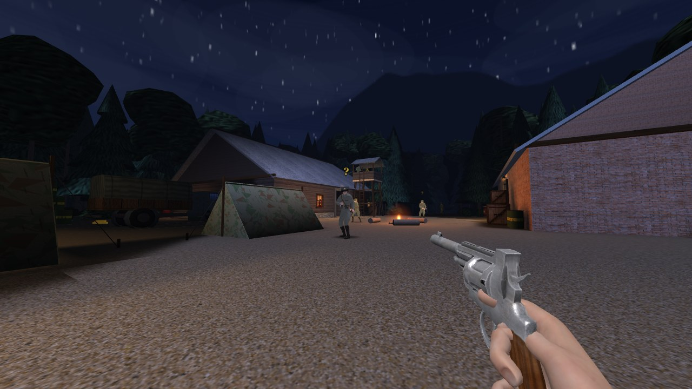
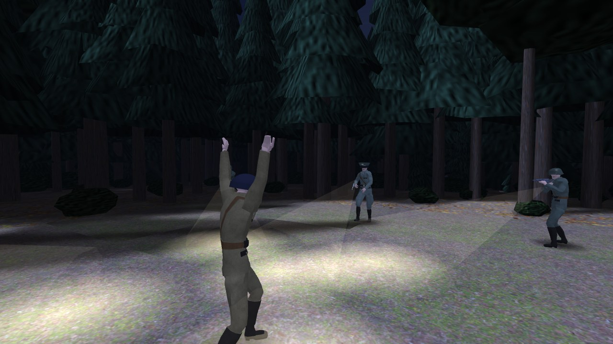
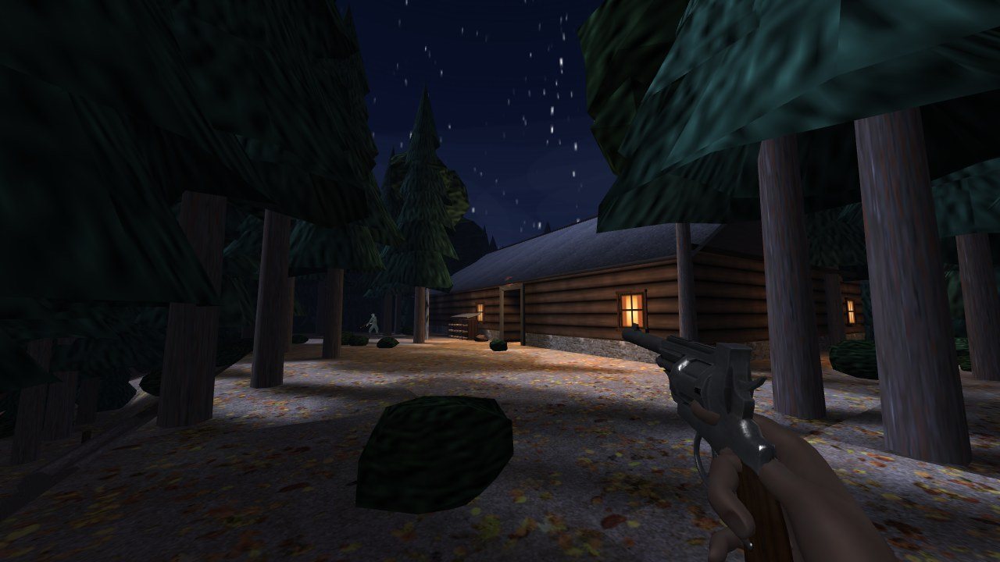

# Blázen z Londýna: Tajná Akce

**1943** – 3D FPS z druhé světové války běžící přímo v prohlížeči, postavený na [three.js](https://threejs.org/) (r160).



Agent B. J. je zajat v Bavorských Alpách a uvržen do kobek hradu Grimhold. Hra má **tři epizody a deset misí** a začíná cutscénou, ve které ho Němci chytí v lese:

| Epizoda | Mise |
| --- | --- |
| **1 · Útěk z Grimholdu** | 1.1 Kobky · 1.2 Velitelství · 1.3 Krypta |
| **2 · Noční hvozd** | 2.1 Údolní stanice · 2.2 Lesní tábor · 2.3 Nádraží Wolfsgrund · 2.4 Zvláštní vlak |
| **3 · Operace Finsternis** | 3.1 Brána Wolfsgrund · 3.2 Podzemní továrna · 3.3 Srdce temnoty |

Epizoda 1 se odehrává v hradu. Epizoda 2 je venku, v noci a daleko od hradu: smrkové lesy, mýtiny, hájovna, kontrolní stanoviště, polní tábor s věžemi a reflektory a nádraží s vlaky. Epizoda 3 začíná na vykládací rampě pod skalní stěnou a pokračuje do podzemní továrny na rakety až k finálnímu souboji s Übersoldatem Mk II.



## Rozšíření: Blázen z Londýna – Zajetí Orla

Hlavní menu má vpravo dole velký banner **ZAJETÍ ORLA – HRAJ NYNÍ**. V rozšíření hraješ za **Hauptmanna Brandta**, německého důstojníka, kterého Orel málem zastřelil u údolní stanice lanovky (mise 2.1 hlavní hry). Brandt přežije a vydá se Orla najít. Proti němu stojí partyzáni, britská komanda, jejich velitelé a odstřelovači.

| Epizoda | Mise |
| --- | --- |
| **1 · Ve stopách Orla** | 1.1 Ráno po útoku · 1.2 Spálený tábor · 1.3 Odjezd zvláštního vlaku |
| **2 · Zajetí Orla** | 2.1 Brána Wolfsgrund · 2.2 Podzemní továrna · 2.3 Srdce temnoty |

- V každé misi najdeš tři Orlovy stopy a pak se dostaneš k východu.
- **Úvodní cutscéna:** Orel u lanovky postřílí Brandtovy muže a Brandta těžce zraní. Brandt přísahá pomstu.
- **Závěrečná cutscéna:** hned po porážce Übersoldata Mk II a výbuchu hory čeká Brandt na Orla před štolou. Následuje asi 15sekundový souboj na nože a Orel vyhraje.
- Mise rozšíření se odemykají zvlášť a postup se ukládá v prohlížeči.
- Vedle banneru je upoutávka na druhé rozšíření **Blázen z Londýna: Studená válka** (Orel, Berlín 1961, coming soon).

## Cutscény a dabing

- Cutscény běží přímo v enginu na skutečných mapách. B. J. má vlastní model hráče (olivová americká uniforma, pletená čepice), Němci mají zbraně a baterky a kamera se pohybuje po trase. Obraz má černé pruhy a titulky. Mezerníkem se scéna přeskočí.
- Scény: zajetí v lese a útěk z cely (začátek hry), sjezd lanovkou do údolí (epizoda 2), zvláštní vlak ve Wolfsgrundu (epizoda 3) a výbuch hory (konec hry).
- **Dabing** je vygenerovaný neuronovým TTS [Piper](https://github.com/OHF-Voice/piper1-gpl), které běží offline. Hlas B. J. a vysílačky z Londýna je český, vojáci, důstojníci a dr. Zeman mluví německy s českými titulky.
- Stráže mluví i během hry („Was war das?“, „Alarm!“, „Mein Gott, ein Toter!“…) a každý voják má svůj hlas.
- **Realističtější dabing:** skript `tools/make_voices_neural.py` (ve Windows stačí spustit `tools/make_voices_neural.bat`) přegeneruje všech 72 replik přirozenými neuronovými hlasy Microsoft (B. J. a Londýn česky – Antonín, Němci – Conrad, Killian, rakouský Jonas pro dr. Zemana, švýcarský Jan). Potřebuje internet, Python (`pip install edge-tts`) a ffmpeg. Výsledek zapíše do `assets/voices.js`, hra ho načte po obnovení stránky.



## Plížení

- **Tichá likvidace** – tělo vojáka zabitého tlumenou zbraní (Welrod, De Lisle) nebo nožem zezadu si stráže nevšimnou hned. Nejdřív zpozorní (**?**), dojdou se podívat a teprve u těla spustí poplach. Ve tmě a z dálky jim to trvá mnohem déle, po hlasité střelbě vědí hned.
- **Noc venku** – pod korunami stromů je tma a jsi tam skoro neviditelný, na louce v měsíčním světle jsi vidět.
- **Reflektory** na věžích kolem sebe přejíždějí. Kdo se ocitne v kuželu, toho strážný na věži do vteřiny vidí. Reflektor jde rozstřelit, nebo ho zhasneš zničením generátoru (mise 3.1).
- **Baterky** – hlídky v lese svítí před sebe a v kuželu baterky tě uvidí i ve tmě.
- Úkoly misí: zničit telefonní ústřednu, vyhodit do vzduchu sklad paliva, přestavit výhybku ve stavědle, položit nálože k turbínám, sebrat propustku a klíče, dopadnout dr. Zemana.

## Spuštění

Hra nepotřebuje žádný vlastní server, three.js i všechny modely, zvuky a dabing jsou přibalené v repozitáři (`assets/`).

- **Na webu (GitHub Pages):** v nastavení repozitáře zapni *Settings → Pages → Build and deployment → Source: Deploy from a branch*, vyber větev `main` a složku `/ (root)` a dej *Save*. Za minutu běží hra na <https://zuhagames.github.io/ProjectCastle/>.
- **V Google Sites:** *Vložit → Vložit (Embed) → Podle adresy URL* a zadej adresu z GitHub Pages výš, pak rámeček roztáhni na celou šířku. Kdyby vložená stránka nedovolila zamknout myš, hra sama nabídne tlačítko **Otevřít v novém okně** (v menu jsou i tlačítka *Celá obrazovka* a *Otevřít v novém okně*).
- **Z disku:** stačí otevřít `index.html` dvojklikem. Three.js se v tom případě stáhne z CDN (jsDelivr), takže je potřeba internet.

Fotografické textury (Poly Haven) jsou volitelné – když nejsou dostupné, hra si textury vygeneruje procedurálně.

## Ovládání

| Klávesa | Akce |
| --- | --- |
| `WASD` | pohyb |
| `Space` | skok / přeskočit cutscénu |
| `LMB` | střelba |
| `RMB` | míření přes mířidla / puškohled |
| `R` | přebít |
| `F` | použít / dveře / položit nálož / přestavit výhybku |
| `Q` / `E` | vyklonit se |
| `Shift` | sprint |
| `C` | přikrčit / plížit (přepínač, v nastavení lze změnit na držení) |
| `1`–`8` / kolečko | výběr zbraně |
| `Tab` (držet) | mapa celé úrovně s vyznačenými cíli mise |
| `M` | zvuk on/off |
| `Esc` | pauza |

## Zbraně

Lee-Enfield No.4 (T) s puškohledem, revolver, Sten Mk II, plamenomet, mačeta, granát (Stielhandgranate) a dvě tiché zbraně SOE: pistole **Welrod Mk I** (9 mm, integrovaný tlumič) a tlumená karabina **De Lisle (T)** s puškohledem (.45 ACP). Když začneš pozdější misi z menu, dostaneš zbraně, které bys měl touto dobou mít.

## Nastavení

V menu i v pauze: citlivost a obrácení myši, FOV, hlasitost, velikost rozhraní, rozlišení vykreslování, způsob přikrčení, minimapa a pohupování kamery. Nastavení se ukládá v prohlížeči. Minimapa ve stylu Wolfensteinu odkrývá místnosti, jak jimi procházíš (les je zelený, budovy hnědé).

## Novinky ve verzi 1.4

- **Nové menu ve stylu moderních Wolfensteinů:** úvodní obrazovka „Stiskni libovolnou klávesu“, kovové logo, menu vlevo s červeným zvýrazněním (myš i šipky + Enter, Esc zpět, zvuky), panel s informacemi k vybrané položce, výběr mise s kartami epizod a stavem misí, nová obrazovka Titulky, filmové zrno a žhavé jiskry. Pozadí menu je živá 3D scéna: vlevo hrad Grimhold pod rudým nebem s reflektory a pochodujícími německými vojáky, vpravo Londýn (Big Ben se svítícími ciferníky, parlament, St Paul's, Tower Bridge, Temže, balóny) s britskými vojáky; obě vlajky vlají, kamera jemně pluje a reaguje na myš.
- **Dev menu (F8 nebo `):** zbraně a munice, nesmrtelnost, nekonečná munice, průchod zdmi (Space/C nahoru/dolů), zmrazení/zabití/uklidnění nepřátel, spawn libovolného nepřítele, splnění úkolů, dokončení mise, skok na libovolnou misi, odemknutí všech misí.
- **Mise 2.4 · Zvláštní vlak:** probojuješ se jedoucím vlakem vagon po vagonu (služební vůz, otevřený vůz, krytý vůz, plošina s raketou, vůz s municí, protiletadlový vůz, tendr) až do lokomotivy. Tam převezmeš řízení: `W` regulátor, `S` brzda. V zatáčce a na mostě dodržuj rychlost, jinak vykolejíš, a ve Wolfsgrundu zastav u rampy dřív, než narazíš do zarážedla.
- **Realističtější dabing:** nový generátor s neuronovými hlasy (viz *Cutscény a dabing*).
- V menu vpravo dole banner rozšíření **Zajetí Orla** (viz výše) a upoutávka na **Studenou válku** (coming soon).

## Novinky ve verzi 1.3

- Hra se jmenuje **Blázen z Londýna: Tajná Akce**.
- Nové hlavní menu: animovaný obraz – vlevo německé linie a hrad, vpravo válečný Londýn (Big Ben, balóny, reflektory) – a pochodová hudba ve stylu starého Wolfensteinu, syntetizovaná přímo v prohlížeči (hlasitost v nastavení).
- Podržením `Tab` se zobrazí mapa úrovně s očíslovanými cíli, východem a seznamem úkolů. Úkoly mise jsou na obrazovce pořád.
- Hrad má zvenku střechy a vnější zdi – z nádvoří, hradeb a stanice lanovky už není vidět dovnitř místností. Hradní kaple je zvenku skutečný kostel se sedlovou břidlicovou střechou, opěrnými pilíři, vitrážemi, rozetou a zvonicí s měděnou věží.

## Novinky ve verzi 1.2

- 3 epizody a 9 misí, z toho čtyři venkovní noční mapy (les, hájovna, polní tábor, nádraží, rampa pod skálou) a dvě podzemní (továrna na rakety, Zemanova laboratoř).
- Venkovní engine: smrkové lesy se stíny korun v měsíčním světle, keře, kameny, budovy se střechami a rozsvícenými okny, ostnaté dráty, věže s reflektory, stany, vlaky, koleje, návěstidla, skalní stěna.
- Cutscény s modelem hráče, dabing (Piper TTS) a titulky, německé hlášky stráží.
- Pozdější odhalení těl po tichém zabití, reflektory, baterky hlídek.
- Nové cíle misí: nálože, páka výhybky, generátor reflektorů, sklad paliva; boss Übersoldat Mk II a dr. Zeman.

## Struktura projektu

```
index.html             # celá hra (HTML + JS); castle_grimhold.html jen přesměrovává na index.html
assets/
  models.js            # zbraně, ruce a němečtí vojáci (FBX) zabalení do JS
  characters.js        # animace (Soldier.glb) a boss (Xbot.glb) zabalené do JS
  sounds.js            # zvukové efekty (MP3) zabalené do JS
  voices.js            # dabing (MP3) zabalený do JS
  models/              # zdrojové modely (.fbx, .glb)
  sounds/              # zdrojové zvuky (.mp3)
  voices/              # zdrojové nahrávky dabingu (.mp3)
  CREDITS.txt          # autoři a licence assetů
tools/
  make_voices.py       # vygeneruje dabing přes Piper (repliky, hlasy, efekty vysílačky)
```

## Credits

3D modely zbraní, ruce a němečtí vojáci jsou CC0 z [OpenGameArt.org](https://opengameart.org/) (Lucian Pavel, ege, elmerenges, para, nisu), animace z příkladů three.js (MIT / Mixamo), zvuky CC0 od [Kenney](https://kenney.nl/) a z OpenGameArt, fotografické textury CC0 z [Poly Haven](https://polyhaven.com/). Dabing: Piper TTS s hlasy „jirka“ (cs, CC0), „thorsten“ a „thorsten_emotional“ (de, CC0) a „karlsson“ (de, M-AILABS). Podrobnosti v [assets/CREDITS.txt](assets/CREDITS.txt).
