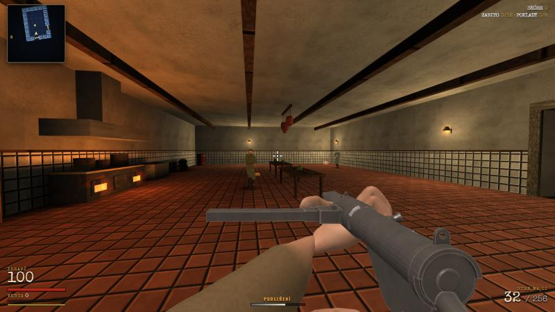
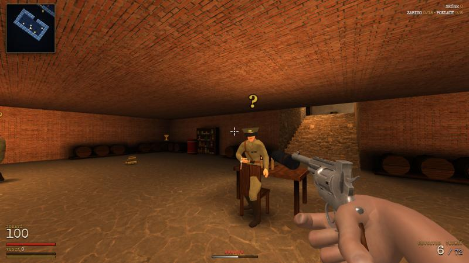

# Castle Grimhold

**Operation Iron Wolf · 1943** – 3D FPS z druhé světové války běžící přímo v prohlížeči, postavený na [three.js](https://threejs.org/) (r160).



Proplížíš se a probojuješ hradem Grimhold přes tři mise:

1. **Mise 1 · Kobky**
2. **Mise 2 · Velitelství**
3. **Mise 3 · Krypta**



## Spuštění

Hra je jeden HTML soubor, ale kvůli načítání assetů ji spusť přes lokální server (ne přes `file://`):

```bash
python -m http.server 8765 --bind 127.0.0.1
```

Pak otevři <http://127.0.0.1:8765/castle_grimhold.html>.

Three.js se načítá z CDN (jsDelivr), takže je potřeba připojení k internetu. Modely, textury zbraní a zvuky jsou zabalené v `assets/*.js`. Webové textury jsou volitelné – když nejsou dostupné, hra si textury vygeneruje procedurálně.

## Ovládání

| Klávesa | Akce |
| --- | --- |
| `WASD` | pohyb |
| `Space` | skok |
| `LMB` | střelba |
| `RMB` | míření přes mířidla (revolver, Sten) / puškohled (puška) |
| `R` | přebít |
| `F` | použít / dveře |
| `Q` / `E` | vyklonit se |
| `Shift` | sprint |
| `C` | přikrčit / plížit (přepínač, v nastavení lze změnit na držení) |
| `1`–`8` / kolečko | výběr zbraně |
| `Tab` | úkoly mise |
| `M` | zvuk on/off |
| `Esc` | pauza |

## Zbraně

Lee-Enfield No.4 (T) s puškohledem, revolver, Sten Mk II, plamenomet, mačeta, granát (Stielhandgranate) a dvě tiché zbraně SOE: pistole **Welrod Mk I** (9 mm, integrovaný tlumič) a tlumená karabina **De Lisle (T)** s puškohledem (.45 ACP).

- **Tiché zbraně** – Welrod leží ve strážnici první mise, De Lisle ve vinném sklepě. Jejich výstřel uslyší jen stráže v těsné blízkosti a nemají záblesk, který by tě prozradil. Obě se po každé ráně natahují ručně (otočný závěr Welrodu, závěr Lee-Enfieldu).
- **Snazší získávání zbraní** – padlí vojáci upustí svou zbraň (Sten, puška), dokud ji ještě nemáš. Plamenomet je i ve zbrojnici druhé mise.

## Nastavení

V menu i v pauze: citlivost a obrácení myši, FOV, hlasitost, velikost rozhraní (škáluje se s rozlišením), rozlišení vykreslování, způsob přikrčení, minimapa a pohupování kamery. Nastavení se ukládá v prohlížeči.

V levém horním rohu je minimapa ve stylu Wolfensteinu, která odkrývá místnosti, jak jimi procházíš.

## Novinky ve verzi 1.1

- Nové ruce z pohledu první osoby, které zbraně skutečně drží (IK na rukojeti, prsty kolem úchopu), rukávy britské vlněné uniformy.
- Opravený Sten (zásobník už nelevituje) a nové textury Stenu a granátu.
- Nepřátelé jsou němečtí vojáci 2. světové války (Wehrmacht, SS, důstojníci, odstřelovači v maskáči, nemrtví) se Stahlhelmem nebo čepicí.
- Skutečné zvuky (kroky, dveře, výkřiky, výbuchy, siréna, oheň…), výstřely zůstaly původní.
- Tiché zbraně Welrod a De Lisle, míření přes mířidla, snazší získávání zbraní, menu nastavení, škálování rozhraní, minimapa, přepínací krčení.
- Otazníky a vykřičníky nad mrtvými zmizí, padlí vojáci leží uvolněně a jsou vidět i po zabití mimo záběr.

## Struktura projektu

```
castle_grimhold.html   # celá hra (HTML + JS)
assets/
  models.js            # zbraně, ruce a němečtí vojáci (FBX) zabalení do JS
  characters.js        # animace (Soldier.glb) a boss (Xbot.glb) zabalené do JS
  sounds.js            # zvukové efekty (MP3) zabalené do JS
  models/              # zdrojové modely (.fbx, .glb)
  sounds/              # zdrojové zvuky (.mp3)
  CREDITS.txt          # autoři a licence assetů
```

## Credits

3D modely zbraní, ruce a němečtí vojáci jsou CC0 z [OpenGameArt.org](https://opengameart.org/) (Lucian Pavel, ege, elmerenges, para, nisu), animace z příkladů three.js (MIT / Mixamo), zvuky CC0 od [Kenney](https://kenney.nl/) a z OpenGameArt. Podrobnosti v [assets/CREDITS.txt](assets/CREDITS.txt).
