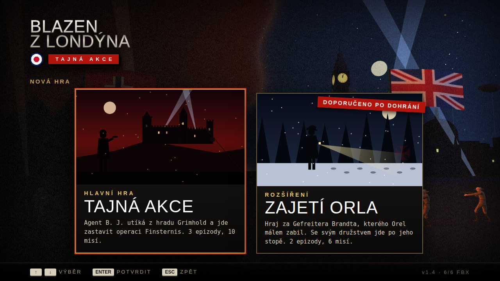
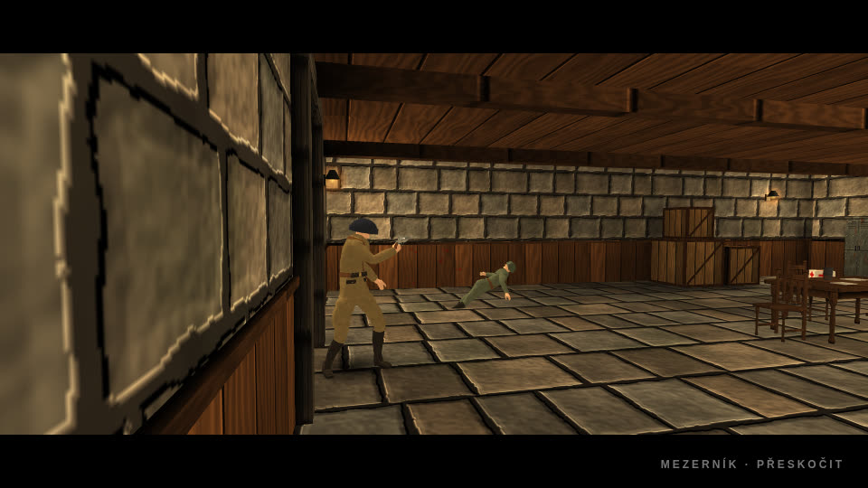
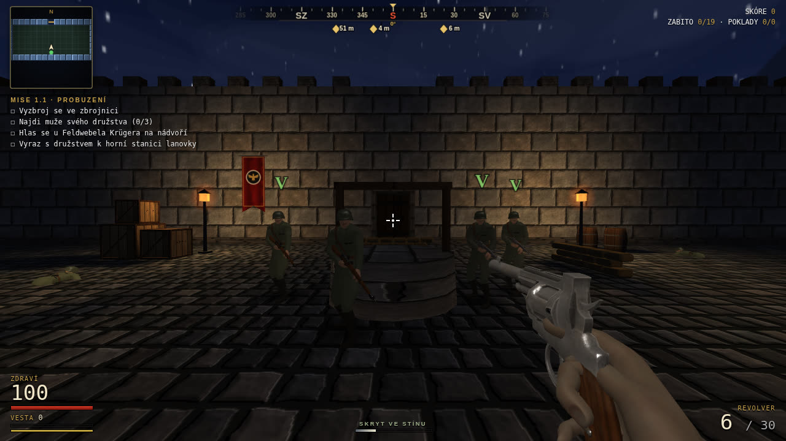

# Blázen z Londýna: Tajná Akce

**Bavorské Alpy, 1943.** Akční FPS z druhé světové války ve stylu starých Wolfensteinů, které běží přímo v prohlížeči (three.js). Přestřelky, plížení ve tmě, cutscény s dabingem a hrad plný tajemství.

## Příběh

Říjen 1943. Americký agent B. J., kterému Londýn říká **Orel**, je chycen v lesích pod hradem Grimhold a odvlečen do kobek. Na hradě sídlí štáb tajné operace **Finsternis** – dr. Zeman tu staví rakety na Londýn a v laboratoři pod kaplí probouzí Übersoldaty.

Orel uteče z cely, ukradne plány, sjede lanovkou do údolí, probojuje se nočním hvozdem, naskočí na zvláštní vlak do podzemní továrny Wolfsgrund – a nechá celou horu vyletět do vzduchu.

| Epizoda | Mise |
| --- | --- |
| **1 · Útěk z Grimholdu** | 1.1 Kobky · 1.2 Velitelství · 1.3 Krypta |
| **2 · Noční hvozd** | 2.1 Údolní stanice · 2.2 Lesní tábor · 2.3 Nádraží Wolfsgrund · 2.4 Zvláštní vlak |
| **3 · Operace Finsternis** | 3.1 Brána Wolfsgrund · 3.2 Podzemní továrna · 3.3 Srdce temnoty |

- **Epizoda 1** – kobky, kuchyně a vinný sklep, rytířský sál, štáb SS, knihovna, kaple a krypta, kde v Zemanově laboratoři čeká první Übersoldat.
- **Epizoda 2** – venku a v noci: smrkové lesy, hájovna na kopci, polní tábor s věžemi a reflektory, nádraží s vlaky. Mise 2.4 se hraje na jedoucím vlaku – probojuješ se vagon po vagonu až do lokomotivy a sám ji dovedeš do Wolfsgrundu.
- **Epizoda 3** – vykládací rampa pod skalní stěnou, podzemní továrna na rakety a finální souboj s Übersoldatem Mk II.

## Rozšíření: Zajetí Orla

Druhá strana příběhu. Hraješ za **Gefreitera Ericha Brandta**, obyčejného vojáka z posádky hradu Grimhold. Tu noc, kdy Orel utekl z kobek, vtrhl do strážnice, zastřelil Brandtovy kamarády Kesslera a Vogta – a Brandta nechal ležet v krvi. Brandt přežil. A teď jde po něm.

Rozšíření se spouští přes **Nová hra** (doporučeno po dohrání hlavní hry) nebo velkým bannerem **HRAJ NYNÍ** v menu.

| Epizoda | Mise |
| --- | --- |
| **1 · Poplach na Grimholdu** | 1.1 Probuzení · 1.2 Horní stanice · 1.3 Sjezd |
| **2 · Zajetí Orla** | 2.1 Hájovna · 2.2 Wolfsgrund · 2.3 Pod hořící horou |

### Tvoje družstvo

Na hradě je poplach a Orel pustil z cel všechny vězně. Brandt se vyzbrojí ve zbrojnici a po hradě posbírá, co zbylo z jeho družstva – **Schütze Müller** se schovává v kuchyni, **Schütze Weber** bojuje s vězni ve sklepě, **Schütze Hoffmann** drží kasárna. Nakonec se hlásí u **Feldwebela Krügera** na nádvoří.

- Muže najímáš klávesou `F`, každý se ozve vlastním hlasem.
- Družstvo tě následuje ve volném klínu, samo si hledá cíle a střílí. Cestu si hledá po jemné mřížce, která zná každý stůl, bednu a sloup; otevírá si dveře a když zaostane, doběhne tě.
- Nepřítel střílí i po tvých mužích. Zraněný voják chvíli leží a pak se zase zvedne.
- Nad tvými muži je zelená značka, takže je v boji nespleteš s nepřítelem.
- Krüger velí: hlásí, kam jít, co se děje a kdo se blíží – německy s českými titulky.

### Lanovka

Na horní stanici přiběhnete pozdě – Orel právě odjíždí v první kabině. Přivoláš druhou a celé družstvo s ní sjíždí do údolí, zatímco partyzáni na pasekách pod lany pálí po kabině. Ty střílíš z oken.

### Dál po jeho stopě

V údolí najdeš krev na zábradlí a stopy do lesa. V hájovně, kde se Orel sešel s odbojem, zjistíš, že míří do Wolfsgrundu – a nad lesem se otevřou padáky: britský výsadek SOE si pro něj přiletěl. U Wolfsgrundu se probiješ přes rampu, zničíš vysílačku komanda a čekáš u únikové štoly. Pak vybuchne hora.

Na konci stojí Brandt proti Orlovi. Oba mají prázdné zbraně – a tak přijdou na řadu nože.

- **Nepřátelé:** vězni z kobek a partyzáni z hor (křičí česky), ve 2. epizodě komando SOE s odstřelovači.
- **Dabing:** 48 replik – Brandt, Krüger, vojáci a hlášení z amplionu německy, Orel a partyzáni česky.

## Jak se to hraje

- **Plížení.** Ve stínu a v noci pod stromy jsi skoro neviditelný. Stráže si všímají postupně (**?** → **!**), slyší kroky a výstřely, tělo zabité tichou zbraní najdou až po chvíli. Reflektory na věžích a baterky hlídek tě odhalí i ve tmě – reflektor jde rozstřelit.
- **Přestřelky.** Vojáci uskakují do stran, důstojníci běží k poplašným zvonům, odstřelovači se třpytí puškohledem. Na vyšší obtížnosti stačí pár zásahů.
- **Úkoly mise** – plány, klíče, propustky, telefonní ústředna, sklad paliva, výhybka, nálože k turbínám, dr. Zeman. Nahoře uprostřed je **kompas** jako v Call of Duty se stupni, světovými stranami a zlatou značkou ve směru cíle se vzdáleností v metrech. `Tab` ukáže mapu celé úrovně s vyznačenými cíli.
- **Minimapa** ve stylu Wolfensteinu odkrývá místnosti, jak jimi procházíš.
- **Čtyři obtížnosti:** Vojín, Desátník, Rytíř, Legenda.

## Zbraně

| Zbraň | |
| --- | --- |
| **Revolver** | spolehlivý, šest ran |
| **Sten Mk II** | dvě rány do těla nebo jedna do hlavy – ale jen 20 nábojů v zásobníku a munice je málo |
| **Lee-Enfield No.4 (T)** | puška s puškohledem |
| **Welrod Mk I** | tichá pistole SOE s integrovaným tlumičem |
| **De Lisle (T)** | tlumená karabina s puškohledem |
| **Plamenomet** | na nemrtvé v kryptě |
| **Mačeta** | tichá likvidace zezadu |
| **Stielhandgranate** | granát |

## Ovládání

| Klávesa | Akce |
| --- | --- |
| `WASD` | pohyb |
| `Shift` | sprint |
| `C` | přikrčit / plížit |
| `Space` | skok / přeskočit cutscénu |
| `LMB` / `RMB` | střelba / míření |
| `R` | přebít |
| `F` | použít, dveře, nálož, najmout vojáka do družstva |
| `Q` / `E` | vyklonit se |
| `1`–`8` / kolečko | výběr zbraně |
| `Tab` (držet) | mapa úrovně s cíli |
| `Esc` | pauza |

**Na mobilu a tabletu** (na šířku): levým palcem joystick kdekoli v levé části obrazovky (zatlačit až na kraj = běh), pravým palcem tažením rozhlížení. Tlačítka PAL (při držení se dá zároveň mířit tažením), MÍŘIT, PŘEBÍT, SKOK, KRČIT, POUŽÍT (rozsvítí se, když je co použít), ZBRAŇ, MAPA a pauza. Menu se ovládá ťuknutím.

## Série

**Blázen z Londýna: Tajná Akce** (hlavní hra) → **Blázen z Londýna: Zajetí Orla** (rozšíření) → **Blázen z Londýna: Studená Válka** – Orel se vrací, Berlín 1961 (připravuje se).

## Credits

3D modely zbraní, ruce a němečtí vojáci jsou CC0 z [OpenGameArt.org](https://opengameart.org/) (Lucian Pavel, ege, elmerenges, para, nisu), animace z příkladů three.js (MIT / Mixamo), zvuky CC0 od [Kenney](https://kenney.nl/) a z OpenGameArt, fotografické textury CC0 z [Poly Haven](https://polyhaven.com/). Dabing: [Piper](https://github.com/OHF-Voice/piper1-gpl) TTS s hlasy „jirka“ (cs, CC0), „thorsten“ a „thorsten_emotional“ (de, CC0) a „karlsson“ (de, M-AILABS). Podrobnosti v [assets/CREDITS.txt](assets/CREDITS.txt).
